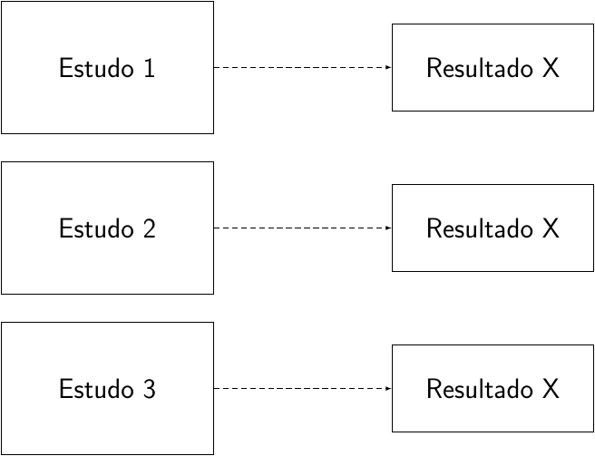
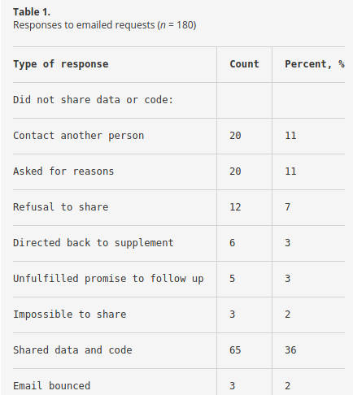
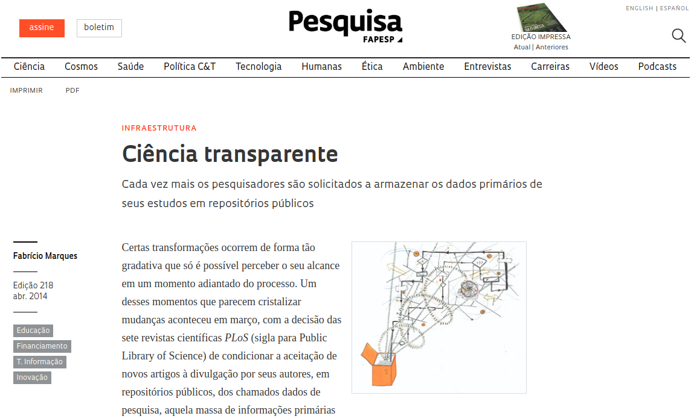
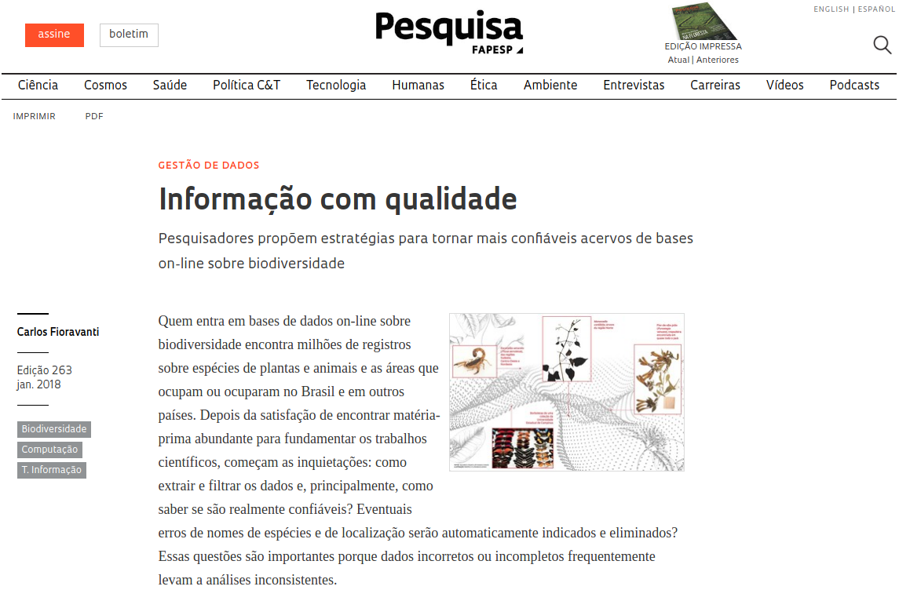
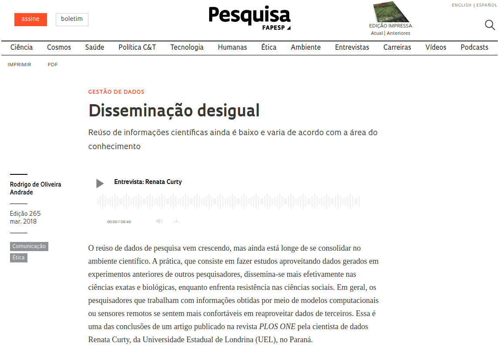
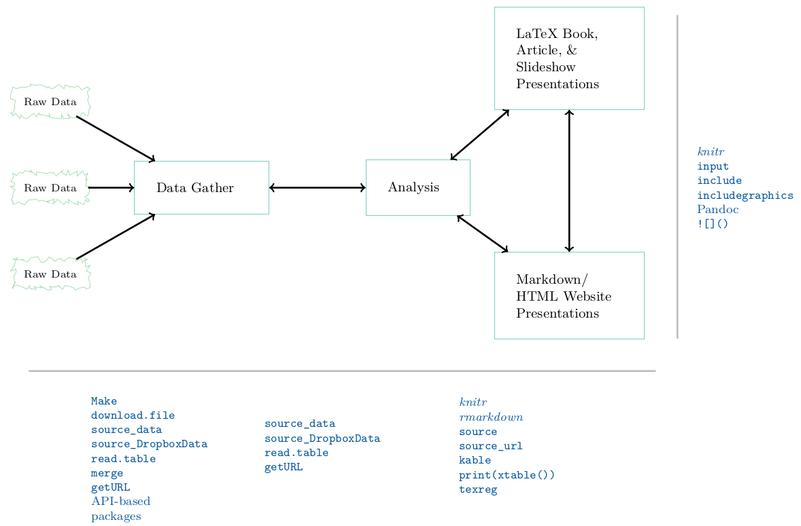
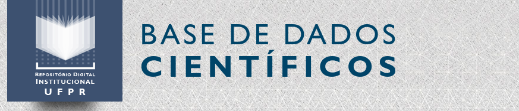

# Introdução

## Introdução

- Evolução da tecnologia: coleta, processamento e análise com bases de
  dados de alta dimensão
- Rotinas de análise mais sofisticadas e complexas
- Como garantir que toda essa informação, e todo esse resultado que vem
  sendo gerado pode ser **confiável**?
- As análises, os modelos e os algoritmos que usamos atualmente são
  bastante complexos: difícil descrever todos os **detalhes em palavras**
- Entender o que alguém fez em uma análise de dados atualmente, requer
  olhar para o **código**

# Um estudo de caso

## *The Duke trial saga*

- Anil Potti *et al*: A Genomic Strategy to Refine Prognosis in
  Early-Stage Non–Small-Cell Lung Cancer. *The New England Journal of
  Medicine*. 2006.
- Prever a evolução do câncer de pulmão de um paciente usando matrizes
  de expressão
- Anil Potti *et al*: Genomic signatures to guide the use of
  chemotherapeutics. *Nature Medicine*. 2006.
- Utilização de "linhas de células", para prever a quimioterapia mais
  eficaz para pacientes que sofrem de câncer de pulmão, mama ou de
  ovário

## *The Duke trial saga*

- O grupo de Duke iniciou três ensaios clínicos baseados nos trabalhos
  publicados.
- Bioestatísticos do *MD Anderson Cancer Centre* tentaram reproduzir os
  resultados do artigo, com a finalidade de usar a nova técnica.
- Foram encontradas diversas falhas como linhas de células com nomes
  errados, nomes e números de células inconsistentes, etc.
- Depois disso, uma série de investigações foram realizadas, levando a
  cessar os ensaios clínicos já iniciados pela Universidade.
- Dr. Potti pediu demissão, e depois foi descoberto que ele tinha
  envolvimento com empresas da área biomédica.

# Como a ciência funciona

## Como a ciência funciona

> *A Ciência é um processo de aprendizado da natureza, onde ideias
> concorrentes sobre como funciona o mundo são medidas contra
> observações.*

> Richard Feynman, 1965

- Descrições: incompletas
- Observações: incertas e imprecisas
- Métodos para avaliar a concordância entre as ideias e as observações =
  **Estatística** (Stigler, 1986).

## Como a ciência funciona

"Árvore de aprendizado" de Platt (1964) a partir de experimentos
críticos, denominada **inferência forte** (*strong inference*), e que
consiste das seguintes etapas:

1. Conceber hipóteses alternativas.
2. Conceber um experimento crucial (ou vários deles) com possíveis
   resultados alternativos, onde cada um poderá excluir, dentro do
   possível, uma ou mais hipóteses.
3. Realizar o experimento de forma a obter resultados mais confiáveis
   possíveis.
4. Reciclar o procedimento, criando subhipóteses ou hipóteses
   sequenciais para refinar as possibilidades que restam, e assim por
   diante.

## Como a ciência funciona

Esta visão de Platt é naturalmente uma extensão lógica do trabalho de
**Popper**, que revolucionou a filosofia da Ciência no século 20, ao
argumentar que uma hipótese **não pode ser provada**, apenas
**desprovada**.

A essência do método Popperiano é "desafiar" uma hipótese repetidamente.
Se a hipótese permanece válida então ela não é validada, mas adquire um
certo "grau de confiança", que na prática passa a ser tratada como
verdadeira.

Coincidindo com esta filosofia de Popper está o trabalho
estatístico de **Ronald Fisher**, **Karl Pearson**, **Jerzy Neyman** e
outros, que desenvolveram grande parte da teoria estatística atual
associada à "testes de hipótese".

## Aprendizado dedutivo-indutivo

- O processo **dedutivo-indutivo** de aprendizado é orientado pelo
  cérebro humano
- É conhecido desde o tempo de Aristóteles e faz parte de nossa
  **experiência cotidiana**

O aprendizado avança conforme ilustrado na figura abaixo (extraída de
Box, Hunter e Hunter, 2005):

```{r, echo=FALSE, out.width='80%'}
knitr::include_graphics("img/deduction-induction.png")
```

## Um loop de feedback

A figura abaixo mostra o processo dedutivo-indutivo como um "loop de
feedback" (extraída de Box, Hunter e Hunter, 2005):

```{r, echo=FALSE, out.width='90%'}
knitr::include_graphics("img/feedback-loop.png")
```

## Frases de Richard Feynman

```{r, echo=FALSE, out.width='60%'}
knitr::include_graphics("img/feynman.jpg")
```

*The statements of science are not of what is true and what is not true,
but statements of what is known with different degrees of certainty.*

*Progress in science comes when experiments contradict theory.*

*It doesn't matter how beautiful your theory is. If it disagrees with
experiment, it's wrong. In that simple statement is the key to science.*

*If you're doing an experiment, you should report everything that you
think might make it invalid - not only what you think is right about
it.*

*In its efforts to learn as much as possible about nature, modern
physics has found that certain things can never be “known” with
certainty. Much of our knowledge must always remain uncertain. The most
we can know is in terms of probabilities.*

@[ProfFeynman](https://twitter.com/ProfFeynman)

## Análise de dados como arte

> *Ciência é conhecimento que entendemos tão bem que podemos ensiná-la
> para um computador. Todo o resto é arte.*

> Donald Knuth, 1974

O processo de análise de dados por um pesquisador pode ser comparado ao
processo de criação de uma música por um músico.

Os métodos já foram ensinados ao computador, cabe ao analista saber como
juntar as ferramentas e aplicá-las para responder questões relevantes
para a ciência e para as pessoas.

# Replicação e reprodução na Ciência

## Replicação e reprodução na Ciência

A **replicação** é um dos pilares fundamentais da ciência.

É necessário que diversos cientistas coletem e analisem dados de forma
independente, e cheguem no mesmo resultado.

Se muitas pessoas diferentes chegarem à mesma conclusão de forma
independente, então tendemos a pensar que a relação ou resultado
provavelmente é verdadeiro (que vai de encontro com a filosofia de
Popper).

## Replicação e reprodução na Ciência

**Replicação**: quando o pesquisador é capaz de chegar nos mesmos
resultados de um estudo anterior, seguindo os **mesmos métodos**, mas
com coleta de **novos dados**.

```{r, out.width='70%', echo=FALSE}

```

## Replicação e reprodução na Ciência

Hoje em dia, a replicação tem se tornado cada vez mais desafiadora:

- Estudos maiores e mais caros
- Disponibilidade de recursos financeiros para pesquisas cada vez mais
  escassa

Além disso, existem estudos que dificilmente podem ser replicados:

- Avaliação do impacto de um terremoto em um determinado local
- Evolução do crescimento de uma floresta
- Estudo clínico que acompanhou as reações de pacientes à um medicamento
  durante 20 anos

## Replicação e reprodução na Ciência

Existem muitas boas razões pelas quais não podemos replicar um estudo.

Se replicar não é possível, então existem duas opções:

- Não fazer nada (não e uma opção de verdade)
- Reproduzir a pesquisa.

A ideia é criar uma espécie de **padrão mínimo**, ou um *meio-termo*
entre replicar um estudo e não fazer nada.

## Replicação e reprodução na Ciência

**Reprodução**: quando o pesquisador é capaz de chegar nos mesmos
resultados de um estudo anterior, seguindo os **mesmos métodos**, e
utilizando os **mesmos dados**.

```{r, out.width='70%', echo=FALSE}
knitr::include_graphics("img/reproduction.png")
```

## Replicação e reprodução na Ciência

Uma parte fundamental da **pesquisa reproduzível** é tornar disponíveis
**dados** e **métodos computacionais** (em forma de código).

> Um projeto científico é computacionalmente reproduzível se um segundo
pesquisador (incluindo você no futuro) é capaz de recriar os resultados
finais do projeto, incluindo as descobertas quantitativas, tabelas e
figuras, dado apenas um conjunto de arquivos e instruções escritas.

> Justin Kitzes

## Replicação e reprodução na Ciência

[Peng, 2011,
*Science*](http://science.sciencemag.org/content/334/6060/1226.full)

```{r, out.width='100%', echo=FALSE}
knitr::include_graphics("img/F1.large.jpg")
```

## Replicação e reprodução na Ciência

Se reproduzir uma análise leva à um resultado já conhecido e esperado,
então **qual o propósito de uma pesquisa reproduzível**?

Para a Ciência:

- Padrão para julgar descobertas científicas
- Validação da análise de dados
- Diferentes cientistas, com diferentes visões e ideias podem colaborar
  no sentido de continuar a pesquisa, ou sugerir outras abordagens
  (análise de dados como arte)
- Reproducibilidade aprimora a replicabilidade
- Evita esforço duplicado e encoraja o desenvolvimento cumulativo de
  conhecimento

Para você:

- Melhores hábitos de trabalho
- Melhor trabalho em equipe
- Mudanças são mais fáceis
- Maior impacto da pesquisa

## Replicação e reprodução na Ciência

Possíveis preocupações:

- Como fica a questão da propriedade intelectual?
- Como fica a disponibilização de dados que foram coletados com
  financiamento privado ou público?
- Até que ponto a disponibilização dos dados não irá prejudicar meus
  projetos futuros?
- Será que não posso sofrer plágio?

Cientistas estão preocupados em fazer pesquisa reproduzível, mas mesmo
na PLoS, por exemplo, cerca de 60% das publicações não disponibilizam
dados suficientes.

## Replicação e reprodução na Ciência

- A revista *Science* teve uma edição inteira dedicada à
  reproducibilidade.
- Muitas revistas científicas tem atualizado suas políticas de
  publicação, para encorajar a reproducibilidade dos artigos publicados.

    - *Public Library of Science* (PLoS)
    - Biostatistics

```{r, out.width='90%', echo=FALSE}

```

## Replicação e reprodução na Ciência

**An empirical analysis of journal policy effectiveness for computational
reproducibility**. [PNAS,
2018](http://www.pnas.org/content/115/11/2584).

Victoria Stodden, Jennifer Seiler, and Zhaokun Ma

- Requisitaram dados e códigos para autores de artigos da revista
  *Science* publicados após 2011 (quando a política de publicação foi
  alterada)
- Tentaram replicar os estudos de 204 artigos
- Obtiveram dados e códigos de 44% dos autores
- Conseguiram reproduzir 26% deles

## Replicação e reprodução na Ciência

```{r, echo=FALSE, out.width='65%'}

```

[Stodden *et al*, 2018](http://www.pnas.org/content/115/11/2584).

## Replicação e reprodução na Ciência

Algumas respostas recebidas ([Stodden *et al*,
2018](http://www.pnas.org/content/115/11/2584)):

*When you approach a PI for the source codes and raw data, **you better
explain who you are**, whom you work for, why you need the data and what
you are going to do with it.*

*I have to say that **this is a very unusual request** without any
explanation! Please ask your supervisor to send me an email with a
detailed, and I mean detailed, explanation.*

*The **data files remains our property** and are not deposited for free
access. Please, let me know the purpose you want to get the file and we
will see how we can help you.*

*We **do not typically share our internal data or code** with people
outside our collaboration.*

*The code we wrote is the **accumulated product of years of effort** by
[redacted] and myself. Also, the data we processed was collected
painstakingly over a long period by collaborators, and so we will need
to **ask permission from them too**.*

*Normally we do not provide this kind of information to people we do not
know. It might be that you want to check the data analysis, and that
might be of some use to us, **but only if you publish your findings while
properly referring to us.***

*Thank you for your interest in our paper. For the [redacted]
calculations **I used my own code, and there is no public version of this
code, which could be downloaded**. Since this code is **not very
user-friendly** and is under constant development **I prefer not to share
this code**.*

*I’m sorry, but **our computer code was not written with an eye toward
distributing for other people to use**. The codes are not documented and
we don’t have the time or resources to document them. If you have a
particular calculation you would like done and it is not a major
extension of what we are presently set up to do, we might be able to run
the codes for you.*

*R is a free software package available at www.r-project.org. I used R
for the [redacted] models. As you probably know, [redacted] and
[redacted] **are quite complicated**. But I don’t have to tell you that
**given that you are a statistics student**! I used Matlab for the
geometry.*

## Replicação e reprodução na Ciência

[Revista FAPESP,
2014](http://revistapesquisa.fapesp.br/2014/04/24/ciencia-transparente/?cat=politica)

```{r, echo=FALSE, out.width='100%'}

```

## Replicação e reprodução na Ciência

[Revista FAPESP,
2018](http://revistapesquisa.fapesp.br/2018/01/16/informacao-com-qualidade/?cat=politica)

```{r, echo=FALSE, out.width='100%'}

```

## Replicação e reprodução na Ciência

[Revista FAPESP,
2018](http://revistapesquisa.fapesp.br/2018/03/20/disseminacao-desigual/?cat=politica)

```{r, echo=FALSE, out.width='100%'}

```

# Elementos da reproducibilidade

## Elementos da reproducibilidade

Quatro elementos principais:

1. **Dados**: Os dados utilizados na análise devem ser disponibilizados
   *da maneira como foram analisados originalmente*.
2. **Código**: O código utilizado para produzir os resultados
   apresentados.
3. **Documentação**: Descrever o **código** e os **dados** utilizados na
   análise de maneira clara.
4. **Distribuição**: Distribuir todos esses elementos de maneira que
   sejam facilmente acessíveis.

## Elementos da reproducibilidade

Estudos recentes tem mostrado que cientistas passam cerca de 30% de seu
tempo escrevendo códigos.

No entanto, mais de 90% deles são primariamente *auto-didatas*, e portanto
carecem de exposição à boas práticas de desenvolvimento de *software*
como:

- Escrever códigos de fácil manutenção
- Usar um *sistema de controle de versões*
- Rastreadores de *bugs*
- Testes unitários
- Automação de tarefas

## Boas práticas para a computação científica

1. Escreva programas para humanos, não para computadores
2. Deixe o computador fazer o trabalho
3. Faça alterações incrementais
4. Não repita você mesmo (ou outros)
5. Prepare-se para erros
6. Otimize código apenas depois que ele funcionar
7. Documente a ideia e o propósito, não a mecânica
8. Colabore

# Ferramentas da reproducibilidade

## Ferramentas da reproducibilidade

Publicar dados e códigos não é necessariamente uma tarefa trivial.

Problemas comuns:

- Muitos autores simplesmente "colocam" arquivos na *web*.
- Existem jornais que disponibilizam materiais suplementares, mas que
  sabidamente são desorganizados ou falhos.
- Mesmo quando dados e códigos estão disponíveis, o leitor ainda tem que
  baixar dados e códigos, e então tentar juntar tudo, uma tarefa que
  geralmente não é fácil e desencoraja a maioria das pessoas.
- O leitor pode não ter os mesmos recursos computacionais que o
  autor.

## Os 3 estágios básicos de um projeto de pesquisa

1. Aquisição de dados
2. Análise de dados
3. Apresentação/publicação

Cada estágio envolve **ferramentas** diferentes

## Os 3 estágios básicos de um projeto de pesquisa

[Gandrud, 2015](http://christophergandrud.github.io/RepResR-RStudio/index.html)

```{r, echo=FALSE, out.width='100%'}

```

## Ferramentas da reproducibilidade

Existem várias ferramentas para auxiliar a tornar uma pesquisa
reproduzível. Algumas que valem a pena conhecer são:

- **R**: para análise de dados, gráficos e tabelas. **Importante:**
  software livre e de código aberto.
- **knitr** e **rmarkdown**: pacotes do R para *literate programming*.
  Permite escrever texto e código (executável) em um mesmo documento.
- **Linguagens de marcação**: instruções para estruturar um texto.
  Exemplos são LaTeX, Markdown, e HTML.
- **Editores de texto**: que permitam trabalhar com todos os formatos.
  Exemplos: Emacs, Vim, RStudio.
- **Armazenamento e versionamento**: serviços como Dropbox, mas
  principalmente Git (Github, Gitlab, etc)
- **Programas em shell**: permitem automatizar uma série de tarefas na
  camada de arquivos e dados.

## Ferramentas da reproducibilidade

Algumas dicas para ajudar a tornar um projeto reproduzível:

1. Documente tudo!
2. Tudo é um arquivo (de texto)
3. Todos os arquivos devem poder ser lidos por humanos
4. Organize e "amarre" seus arquivos de forma apropriada
5. Tenha um plano para organizar, armazenar, e tornar seus arquivos
   disponíveis

## Documentos dinâmicos

> *Instead of imagining that our main task is to instruct a computer what
> to do, let us concentrate rather on explaining to humans what we want
> the computer to do.*
>
> Donald Knuth

Uma das ferramentas mais importantes para pesquisa reproduzível nos dias
de hoje.

A proposta é de distribuir dados e códigos **documentados** de uma
pesquisa científica, de maneira acessível e auto-contida.

## Documentos dinâmicos

O ideia básica por trás de documentos dinâmicos decorre diretamente do
conceito de *literate programming* ("programação letrada"), um paradigma
concebido por Donald Knuth em 1984.

A ideia geral de um documento dinâmico é a de que ele pode ser gerado a
partir de um **código-fonte**:

- Da mesma forma que um *software* possui seu código-fonte, um documento
  dinâmico é o código-fonte de um relatório.
- É uma combinação de código de computador e as correspondentes
  narrativas descrevendo o resultado que o código está gerando (números,
  tabelas, figuras, ...).
- Quando **compilamos** o documento dinâmico, o código de computador é
  executado, e as saídas são apresentadas. Portanto obtemos um documento
  final que mistura **código** e **texto**.

No R:

- Sweave
- knitr
- rmarkdown

## Distribuição de dados

A disponibilização (e aquisição) de dados abertos pode ser feita através
de **repositórios de dados**.

Alguns exemplos são:

- [figshare](https://figshare.com/): permite publicar individualmente
  figuras, imagens, tabelas, vídeos, e dados. Cada compartilhamento
  possui um **DOI**, e assim pode ser referenciado e citado.
- [zenodo](https://zenodo.org/): compartilhamento de texto e dados.
  Também possui DOI e identifica pesquisadores pelo
  [Orcid](https://orcid.org/).
- [Nature recommended data
  repositories](https://www.nature.com/sdata/policies/repositories):
  compilação de diversos repositórios de áreas específicas
- [re3data](https://www.re3data.org/): *REgistry of REsearch Data
  REpositories* é um buscador de bases de dados abertos

## Distribuição de dados na UFPR


```{r, echo=FALSE, out.width='100%'}

```

- A Base de Dados Científicos da Universidade Federal do Paraná (BDC/UFPR)
é o resultado de uma parceria entre o Centro de Computação
Científica e Software Livre (C3SL), e o Sistema de Bibliotecas (SiBi)
UFPR.
- Visa reunir os dados científicos utilizados nas pesquisas que foram
publicadas pela comunidade da UFPR em teses, dissertações, artigos de
revistas, e outros materiais bibliográficos.
- Também possui DOI
- https://bdc.c3sl.ufpr.br/

# Mais recursos

## Mais recursos

- Box, GEP; Hunter, JS; Hunter, WG. [Statistics for experimenters:
  Design Innovation and Discovery](http://statisticsforexperimenters.net).
  John Wiley & Sons, 2005.
- Kitzes, J., Turek, D., & Deniz, F. (Eds.). (2018). [The Practice of
  Reproducible Research: Case Studies and Lessons from the
  Data-Intensive
  Sciences](https://www.practicereproducibleresearch.org/).
  Oakland, CA: University of California Press
- Software Carpentry [Lessons](https://software-carpentry.org/lessons/)
- [Reproducibility in
  Science](http://ropensci.github.io/reproducibility-guide/). A Guide to
  enhancing reproducibility in scientific results and writing (rOpensci)
- [Pesquisa reproduzível com R](http://cursos.leg.ufpr.br/prr)
- Gandrud, C. (2015). [Reproducible Research with R and R
  Studio](https://www.crcpress.com/Reproducible-Research-with-R-and-R-Studio-Second-Edition/Gandrud/p/book/9781498715379)
- Stodden, V., Leisch, F., Peng, RD. (2014). [Implementing Reproducible
  Research](https://www.crcpress.com/Implementing-Reproducible-Research/Stodden-Leisch-Peng/p/book/9781466561595)
- Gentleman, R, Lang, DT. (2012). [Statistical Analyses and Reproducible
  Research](http://www.tandfonline.com/doi/abs/10.1198/106186007X178663).
  Journal of Computational and Graphical Statistics.
